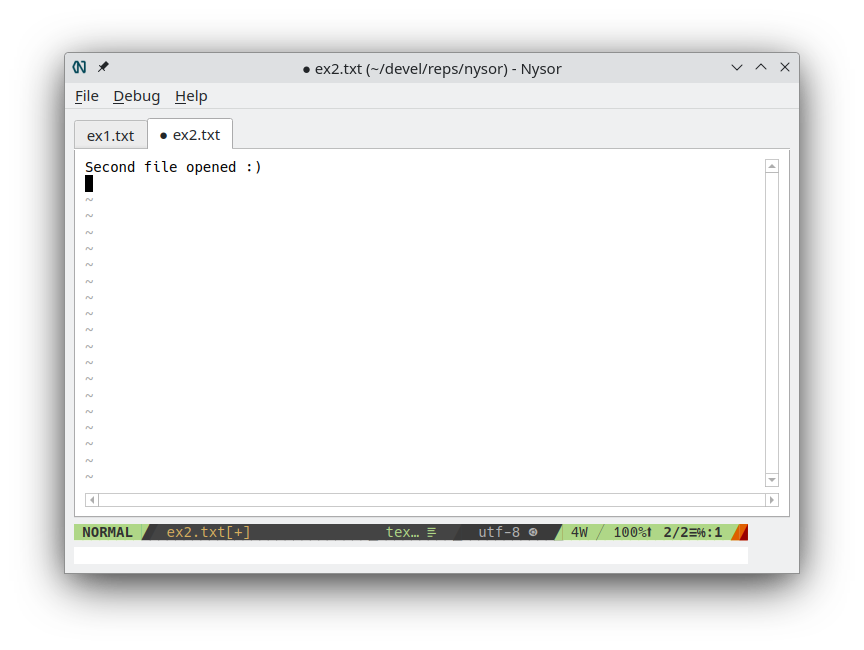

# Welcome to Nysor

Yet another graphical interface for Neovim.

Written in Python, with Qt.


Pronounced similar to "organizer", but without the "orga" and changing the "e" for an "o".


# Why another GUI for Neovim?

It's basically a pet project: one aimed to learn about Neovim and how to use it programmatically. But at the same time the idea is to provide a high quality interface for the everyday usage.


# What does it offer?

Nysor is mainly a GUI with an editor inside. You run it, optionally indicating one or more files to load, and will edit it using Neovim as backend.

<div align="center">
  
  <p><em>Opening two files (the clear background is because of my Neovim config, not a GUI decision)</em></p>
</div>

- **Real Neovim backend, not an emulation**: Nysor doesn't reinvent Vim/Neovim or mimic they keybindings: it runs your actual Neovim underneath, with your config, your plugins, your LSP, and your keymaps exactly as they are today.

- **Real tabs, each backed by its own Neovim window**: Open several files and each one lives in its own tab, with its own scroll position, its own "modified" state, and its own identity. These aren't simulated panes, they're real Neovim windows rendered as native Qt tabs.

- **Pull a tab out into its own window**: Want two files side by side? Drag a tab off the bar (or use the menu) and it becomes its own OS window, just like tearing a tab off a browser. Snap it back whenever you want.

- **Your work is never silently at risk**: Closing a tab with unsaved changes always asks first; and if a file changes on disk while you have it open, Nysor flags it the moment you switch back to that tab. Nothing gets overwritten quietly, yours or anyone else's.

- **Open the same file twice, get no duplicates**: If a file is already open (in this Nysor instance or another one running alongside it), opening it again doesn't spawn a conflicting copy, it just takes you straight to the tab or window where it's already open, avoiding the classic mess of two edits fighting over the same file.


## How to run it?

There is no *end user package* yet but you can run it using `uv`:

```
uvx nysor
```

...or `fades`:

```
fades --check-updates -d nysor -x nysor
```

...or creating manually a virtual environment, installing it, etc.

It should work just fine in Linux and MacOS. See the section below for Windows.


### Opening files

You can indicate it to open a file to edit:
```
nysor myfile.txt
```

Multiple files are allowed:
```
nysor myfile.txt otherfile.md
```

Alternatively, if you want to read from the process' standard input, pass the special `-` indicator; e.g.:
```
grep process.txt | nysor -
```


### Controlling logs

By default some INFO is sent to the terminal.

You can reduce the logs verbosity with `-q/--quiet`, increase it with `-v/--verbose`, or even use `-t/--trace` to see everything that is going one under the hood (specially the interaction with Neovim through the socket).


### Specifying which Neovim to use as backend

Nysor will use `nvim` if it's in the PATH, but you can always specify the binary location, through the command line:
```
nysor --nvim=/usr/local/bin/nvim
```
...or as an environment variable:
```
export NYSOR_NVIM=/usr/local/bin/nvim
nysor
```

In any case, Nysor will check if the Neovim versions is included in the tested list, and alert you if it isn't.


### Running Nysor from the project

For development purposes, or if you want to try the very latest, you can run Nysor directly from the project, but previously you need to create a virtualenv; e.g.:

```
…$ git checkout https://github.com/facundobatista/nysor.git
…$ cd nysor
…/nysor$ python3 -m venv env
…/nysor$ source env/bin/activate
(env) …/nysor$ pip install -e ".[dev]"
(env) …/nysor$ python -m nysor
```

# Roadmap

These are the plans for the future. They are quite informal, the idea is to follow this list, but we can reorder stuff if needed, of if something is requested.


## The path to 1.0

The idea is to have a solid editor in one window for version 1.0; there will be not much more functionality than it currently exists, but it should improve in quality.

These are the items lousely grouped to get there:

**For 0.8:**
- fix vsplit / hsplit
- font size with ctrl-+/-
- Improve swarm discover latency

**For 0.9:**
- FIXME.94 allow logging system to use `logger.trace`
- allow double-level logging (user selected to terminal, debug to a file if configured)
- docs/2026-08-24-optimizations.md

**For 1.0:**
- Think about "distribution"
    - upload it to PyPI and check `uvx` and `fades` work to run it
    - package it with `pyempaq`


## After 1.0

The path after that is less descriptive. The following are the big items I want to add to the editor in the following versions:

**For version 2:**
- add a treeview in the left of the window
    - simple, showing the directory where the process is run
    - if double click in a file, it should open a new window/tab with the new buffer
- split command bar / messages
    - try to separate, if possible, the command bar from Neovim's grid itself
        - add better history and ways to search/filter previous commands
    - try to separate, if possible, the windows for messages from the editor
        - not only from the Neovim *itself* (like `myfile.txt 23L, 10023B written`) but also from plugins, like linters
        - these windows should be easily resizeable, and with buttons somewhere to turn them on/off
        - have a pane specifically for "errors"? (what today is a pop-up)
    https://neovim.io/doc/user/api-ui-events/#ui-cmdline
    https://neovim.io/doc/user/api-ui-events/#ui-messages

**For version 3:**
- double clicking in the tree view should also edit the file
- when open from a terminal, the layout should change according to the indicated parameters
    - if it's one or more files, open them as (multiple) windows, without a treeview
    - if it's a directory, open it with a treeview based in that directory
        - if this is not the first time the directory is "opened", it should remember which files were previosly open
    - if nothing is indicated, open it empty, with no treeview

**For version 4:**
- add functionality to the contextual window (when you right click on a word)
    - FIXME.93
    - to search that token in all the proyect ... maybe also in the project's virtual env?
    - to jump to the definition of that word (function, class, module, etc)

**For version 5:**
- automatically run linters
    - if the standard ones are in the virtual environment, use them, add decorations for their results
- minimum git support
    - decoration of lines added/removed/changed
- support minimal configuration
    - overrid automatic detections, like virtualenv directories, linters to run, etc
    - placement of decoration for line length
    - scrollbars behaviour (never, always, dynamic)
    - nvim exec path

**For version 6:**
- incorporate the possibility of AIs to read/write code


# What about Windows?

Windows is tricky. I want Nysor to run in Windows, but it's not my main platform, and I don't enjoy overcoming the issues there.

We would need a champion to take the project in that platform. Somebody that would want for Nysor to work in Windows and push it to make it possible. Are you that person? *Let's talk*.

I started [this branch](https://github.com/facundobatista/nysor/tree/get-win-back) that solves the network/process details of running Neovim in Windows, but there are other glitches that need to be understood and fixed. Check that out, and send me a message if you are interested in this endeavour. Thanks in advance!

