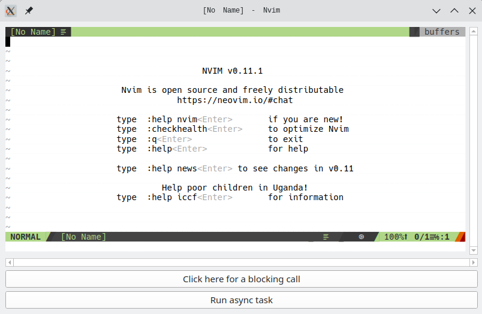

# Welcome to Nysor

Yet another graphical interface for Neovim.

Written in Python, with Qt.

Pronounced similar to "organizer", but without the "orga" and changing the "e" for an "o".


# Why another GUI for Neovim?

It's basically a pet project: one aimed to learn about Neovim and how to use it programmatically. But at the same time the idea is to provide a high quality interface for the everyday usage.


# What it offers?

Nysor is mainly a GUI with an editor inside. You run it, optionally indicating a file to load, and will edit it using Neovim as backend.

In other words, Nysor does not really *edit* the file, it's Neovim, and Neovim is the one that handlers all your keystrokes and (most of) the mouse actions. Nysor is not an *emulation* of Neovim.

Currently, version 0.1, it's just a window with the editor inside. There is nothing extra so far, but all the basics should work. It may have rough edges, though (there are even two buttons for debugging purposes); see below what to expect in the future.

<div align="center">
  
  <p><em>Default init message (the clear background is because of my Neovim config, not a GUI decision)</em></p>
</div>

## How to run it?

You call it from the project (no packaging yet), but previously you need to create a virtualenv; e.g.:

```
…/nysor$ python3 -m venv env
…/nysor$ source env/bin/activate
(env) …/nysor$ pip install -r requirements.txt
(env) …/nysor$ python -m nysor
```

You can indicate it to open a file to edit:
```
(env) …/nysor$ python -m nysor myfile.txt
```

By default, currently, some INFO is sent to the terminal, you can reduce the logs verbosity with `-q/--quiet`, increase it with `-v/--verbose`, or even use `-t/--trace` to see everything that is going one under the hood (specially the interaction with Neovim through the socket).

Nysor will use `nvim` if it's in the PATH, but you can always specify the binary location using `--nvim`.


# Roadmap

These are the plans for the future. They are quite informal, the idea is to follow this list, but we can reorder stuff if needed, of if something is requested.


## The path to 1.0

The idea is to have a solid editor in one window for version 1.0; there will be not much more functionality than it currently exists, but it should improve in quality.

These are the items lousely grouped to get there:

**For 0.4:**

- FIXME.06. isolate logger configuration, maybe switch to foffing, clean print lines converting some to log calls


**For 0.5:**

- present an error window if a `nvim` executable is not Found
    - include instructions to install it
    - not yet configurable, but run it with `--nvim`
- Include the icon, so it's shown in the window decoration


**For 0.6:**

- complete "GUI window"
    - add a very clean menu
    - File: Exit, About
    - the About should present name, icon, and versions for Nysor *and* the nvim it's using
- remove the two debug buttons


**For 1.0:**

- Think about "distribution"
    - upload it to PyPI and check `uvx` and `fades` work to run it
    - package it with `pyempaq`


## After 1.0

The path after that is less descriptive. The following are the big items I want to add to the editor in the following versions:

**For version 2:**
- try to separate, if possible, the command bar from Neovim's grid itself
    - add better history and ways to search/filter previous commands
- try to separate, if possible, the windows for messages from the editor
    - not only from the Neovim *itself* (like `myfile.txt 23L, 10023B written`) but also from plugins, like linters
    - these windows should be easily resizeable, and with buttons somewhere to turn them on/off
    - improve error management around "opening a file that was left open previously because of crashing or similar"
- add a treeview in the left of the window
    - simple, showing the directory where the process is run
    - if double click in a file, it should open a new window/tab with the new buffer
- support multiple buffers open
    - FIXME.90
    - switch back and forward clicking on tabs
    - when going back to a tab, it should check if underneath file changed
    - support closing properly, each tab or the whole program, asking for the buffers that are not properly saved
- remove the "debug buttons"
    - FIXME.91

**For version 3:**
- it should open more than a file if it's given in the command line
    - each file should be a separate window in the "right pane zone"
- double clicking in the tree view should also edit the file
- when open from a terminal, the layout should change according to the indicated parameters
    - if it's one or more files, open them as (multiple) windows, without a treeview
    - if it's a directory, open it with a treeview based in that directory
        - if this is not the first time the directory is "opened", it should remember which files were previosly open
    - if nothing is indicated, open it empty, with no treeview
    - if "`-`" is the parameter, it should handle `stdin`
        - let's see if Neovim supports through API telling it to open stdin
        - otherwise just make it work: open a temporary file with content retrieved from `stdin` and tell Neovim to use that
        - no treeview
        - FIXME.92

**For version 4:**
- different Nysor runs should be different processes, but aware of them
    - if you're trying to open the same file twice, it should not, the other editor should get focus
- add functionality to the contextual window (when you right click on a word)
    - FIXME.93
    - to search that token in all the proyect ... maybe also in the project's virtual env?
    - to jump to the definition of that word (function, class, module, etc)

**For version 5:**
- automatically run linters
    - if the standard ones are in the virtual environment, use them, add decorations for their results
- minimum github support
    - decoration of lines added/removed/changed
- support minimal configuration
    - overrid automatic detections, like virtualenv directories, linters to run, etc
    - placement of decoration for line length
    - scrollbars behaviour (never, always, dynamic)
    - nvim exec path
